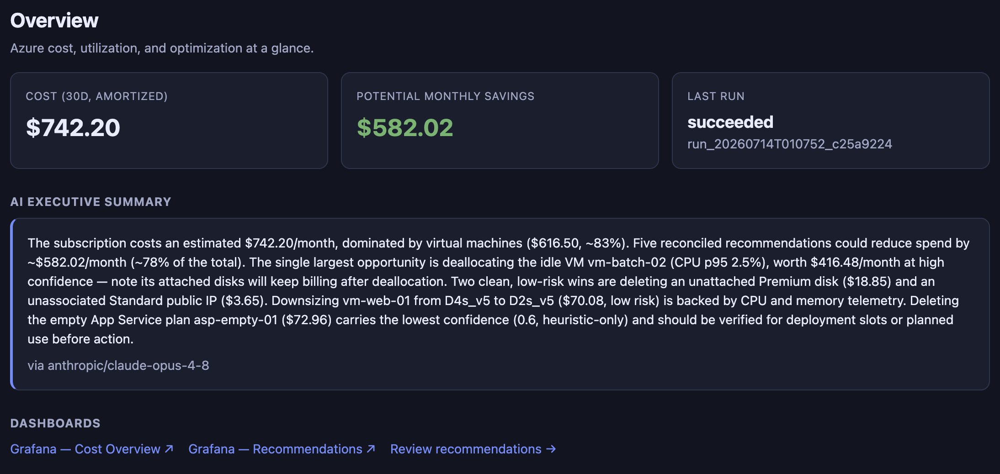

# 5 · Web UI Guide

The Next.js web app at **http://localhost:3001** is the primary human interface.
It talks to the API at `NEXT_PUBLIC_API_BASE` (default `http://localhost:8000`).
Every page is a data-driven table with inline filters and drill-downs — minimal
modal dialogs.

## Navigation

A flat top nav groups the pages logically:

| Group | Pages |
|-------|-------|
| **Overview** | Home dashboard |
| **Cost** | Costs · Recommendations |
| **Governance** | Policies · Collections · Bindings · Compliance |
| **Operations** | Executions · Events · Runs · Remediation |
| **Assets & Audit** | Assets · Subscriptions · Account Groups · Audit |
| **Config** | Notifications |

When SSO is enabled, a **Login** page fronts everything (an `AuthGate` wrapper
enforces auth on all other routes).

## Pages

### Overview (`/`)
Three metric cards (30-day amortized cost, potential monthly savings, last run
status), the AI-generated executive summary, and links into Grafana.
→ `GET /api/summary`, `/api/costs/summary`, `/api/runs/latest`.

The AI executive summary (here, `via anthropic/claude-opus-4-8`) narrates the top
opportunities in plain language — e.g. the single largest win, clean low-risk
deletions, and which findings to verify before acting.

### Costs (`/costs`)
Three tables — cost by resource type, by region, and top-25 resources — all
amortized over 30 days. Read-only.
→ `GET /api/costs/by-type`, `/api/costs/by-region`, `/api/costs/by-resource?limit=25`.

### Recommendations (`/recommendations`)
Table of FinOps findings (priority, resource, action, target SKU, risk badge,
confidence %, monthly savings, source, status) with total potential savings in the
header. **Approve/reject** each; approved items unlock a **Remediate (dry-run)**
button.
→ `GET /api/recommendations`, `POST /api/recommendations/{id}/decision`,
`POST /api/recommendations/{id}/remediate?dry_run=true`.

### Policies (`/policies`)
The Cloud Custodian policy editor: a form (name, description, JSON spec) with
**inline validation**, plus a table of policies (resource type, source, validation
status, enabled state, version). Create/edit/delete, toggle enabled, validate
before save, and open **version history** with a two-version diff.
→ `GET/POST/PUT/DELETE /api/policies`, `POST /api/policies/validate`,
`POST /api/policies/{id}/enabled`, `GET /api/policies/{id}/versions`,
`GET /api/policies/{id}/versions/diff`.

### Collections (`/collections`)
Named policy sets. Each row shows member policies as removable chips plus a
dropdown to add existing policies (many-to-many). Deleting a collection leaves the
policies intact.
→ `GET/POST/DELETE /api/collections`, `POST/DELETE /api/collections/{id}/policies/{policy_id}`.

### Bindings (`/bindings`)
The **collection × account-group** wiring that drives pull-mode runs. Columns:
collection, account group, schedule (cron), mode, dry-run, enabled, last run.
Create/edit inline, toggle enabled, **Run now**, delete.
→ `GET/POST/PUT/DELETE /api/bindings`, `POST /api/bindings/{id}/run`.

### Compliance (`/compliance`)
A split-pane posture explorer: a **by-provider** summary table on top; the left
pane lists policies sorted by non-compliant count (worklist order); the right pane
shows the flagged resources for the selected policy. A **Cloud provider** dropdown
filters both panes. Click a resource to jump to its asset detail.
→ `GET /api/governance/posture?provider=`, `GET /api/governance/policies/{id}/matches`.

### Executions (`/executions`)
Pull-mode run history. Filter by policy, subscription, and status; expand a row to
see the matched resources (lazy-loaded).
→ `GET /api/policy-executions?policy_id=&subscription_id=&status=`,
`GET /api/policy-executions/{id}/matches`.

### Events (`/events`)
Real-time event feed (newest-first): event type, resource ID, subscription,
received time, and the policy executions each delivery triggered. Paginated.
→ `GET /api/events/recent?limit=25&offset=`.

### Runs (`/runs`)
Cost-pipeline run history (collect → analyze → recommend → store) with a **Trigger
run (mock)** button.
→ `GET /api/runs?limit=20`, `POST /api/runs?mock=true`.

### Remediation (`/remediation`)
Audit table of every remediation attempt (from recommendations, policies, or
bindings): timestamp, source badge, action type, resource, dry-run flag, status,
error. Filter by source. Read-only.
→ `GET /api/remediation?limit=100&source=`.

### Assets (`/assets` + detail)
**List:** paginated table (name, cloud badge, type, location, state, tag count,
resource ID) with a **Cloud provider** filter and search by type/location/ID/tag.
**Detail:** metric cards + tags, a relationships table (disk→VM→NIC edges with
neighbour links), a change-history timeline, and a collapsible JSON config viewer.
→ `POST /api/assets/query`, `GET /api/assets/{id}/relationships`,
`GET /api/assets/{id}/history`.

### Subscriptions (`/subscriptions`)
Manage onboarded cloud accounts (Azure/AWS/GCP): name, ID, provider, auth type
(dedicated SP vs shared env), enabled, connection status. Add/edit, **Test
connection**, run a subscription-specific mock, set default, delete.
→ `GET/POST/DELETE /api/subscriptions`, `POST /api/subscriptions/{id}/test`,
`POST /api/subscriptions/{id}/default`, `POST /api/runs?subscription_id=`.

### Account Groups (`/account-groups`)
Named groups of subscriptions (scope for bindings). Member subscriptions shown as
removable chips; add from a dropdown (many-to-many). Deleting a group leaves
subscriptions intact.
→ `GET/POST/DELETE /api/account-groups`,
`POST/DELETE /api/account-groups/{id}/subscriptions/{subscription_id}`.

### Notifications (`/notifications`)
Two sections — **channels** (name, transport, target, enabled) and **templates**
(name, subject, body with variable interpolation). Transports: webhook, Slack,
email, Teams, Jira, ServiceNow.
→ `GET/POST/PUT/DELETE /api/notification-channels` and `/api/notification-templates`.

### Audit (`/audit`)
Append-only log of every governance mutation (who did what to which object,
before/after). Filter by actor and target type; live text search.
→ `GET /api/audit?actor=&target_type=`.

### Login (`/login`)
Only relevant when OIDC is enabled: a **Sign in with SSO** button that fetches the
IdP authorization URL and redirects; the callback sets a session cookie.
→ `GET /api/auth/login`, `GET /api/auth/callback`.

## Notable UX patterns

- **Provider filter** on Assets and Compliance (all clouds / azure / aws / gcp).
- **Drill-down trails:** Compliance policy → matched resources → asset detail;
  Recommendation resource → asset detail; Assets list → detail (config +
  relationships + history).
- **Inline validation** of Custodian JSON in the Policies editor before save.
- **Version control** on policies with a field-by-field diff viewer.
- **Membership chips** for the many-to-many relationships (collections↔policies,
  account-groups↔subscriptions, bindings↔channels).
- **Connection testing** on Subscriptions ("mock ok" vs "connected").

The governance workflow is **collections → bindings → execution → audit**; the
cost workflow is **assets → recommendations → remediation**.
