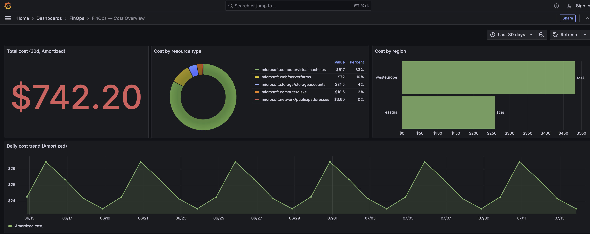
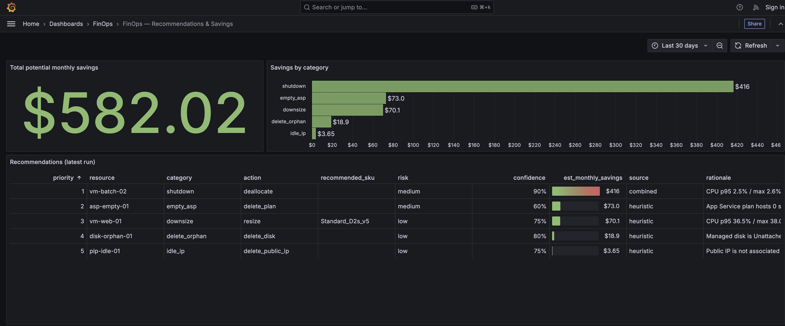

# 13 · Dashboards (Grafana)

Grafana at **http://localhost:3000** reads Postgres directly and ships five
provisioned dashboards in a **FinOps** folder. Anonymous viewing is enabled
(read-only); the admin login is `admin` / `admin` by default.

## Access

| | |
|-|-|
| URL | http://localhost:3000 |
| Anonymous | enabled, `Viewer` role (`GF_AUTH_ANONYMOUS_ENABLED=true`) |
| Admin login | `admin` / `${GF_SECURITY_ADMIN_PASSWORD:-admin}` |
| Health check | `GET /api/health` |

## Datasource wiring

The Postgres datasource is provisioned from
`grafana/provisioning/datasources/datasources.yaml`, parameterized by env
(set in `docker-compose.yml`):

```
FINOPS_DB_HOST=db:5432
FINOPS_DB_NAME=finops
FINOPS_DB_USER=finops
FINOPS_DB_PASSWORD=finops
```

TimescaleDB support is on; SSL is disabled (in-network). Dashboards are
auto-loaded from `grafana/dashboards/` and reload periodically — edit the JSON and
Grafana picks it up. An optional Azure Monitor datasource exists for live metrics
(needs the `AZURE_*` creds; errors harmlessly in mock mode).

## The five dashboards

### FinOps — Cost Overview (`finops-cost.json`)
Total 30-day amortized cost (stat), cost by resource type (donut), cost by region
(bar), daily cost trend (time series), and top-25 resources by cost (table).
Sources: the `v_cost_by_*` views + `cost_snapshots`.



### FinOps — Recommendations & Savings (`finops-recommendations.json`)
Total potential monthly savings (stat), savings by category (bar), the latest-run
recommendations table (priority, resource, action, target SKU, risk, confidence,
savings, source, rationale), a VM utilization-rollup table, and the **AI executive
summary** panel (narrative + provider/model). Sources: `v_latest_recommendations`,
`utilization_rollups`, `ai_summaries`.



### FinOps — Compliance Posture (`governance-posture.json`)
**Template variable: `provider`** (All / azure / aws / gcp). Compliant vs
non-compliant counts (stats), compliance rate, posture split (donut), violations
over time, and posture tables **by provider**, by policy, and by subscription.
Source: `v_governance_posture` (carries the provider column).

### FinOps — Policy Execution Health (`execution-health.json`)
**Template variable: `provider`.** Avg success rate, total/failed executions, avg
duration (stats), success rate by policy (bar gauge), duration over time, and
execution-health tables **by provider**, by policy, and by binding. Source:
`v_execution_health_by_provider` + execution joins.

### FinOps — Policy Health & Compliance (`policy-health.json`)
Avg success rate, distinct policies executed, total resources matched (stats),
resources-matched-over-time, a per-policy health table, and compliance by
subscription. Sources: `v_policy_health`, `v_policy_compliance`.

## Using the provider filter

The **Posture** and **Execution Health** dashboards have a `provider` dropdown at
the top (populated from the data). Set it to a single cloud to scope every panel,
or **All** for the cross-cloud rollup — the same dimension exposed by the API's
`?provider=` query param and the web UI's Cloud filter.

## Customizing

Dashboards are plain JSON under `grafana/dashboards/`. To add or tweak one, edit
the JSON (it's provisioned, so changes in the Grafana UI won't persist across
restarts unless saved back to the file). All panels are Postgres SQL against the
tables and `v_*` views created by `init_db()`.
